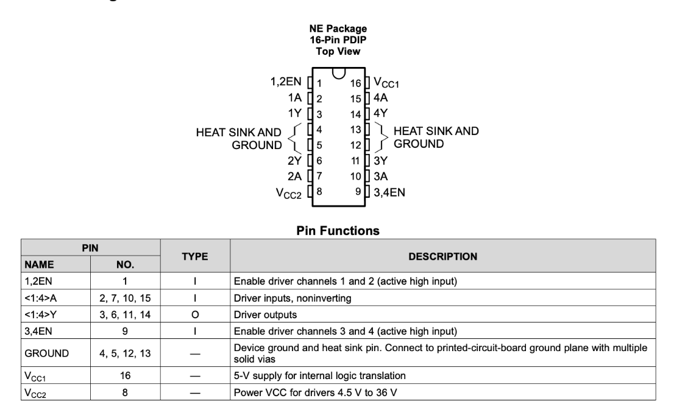
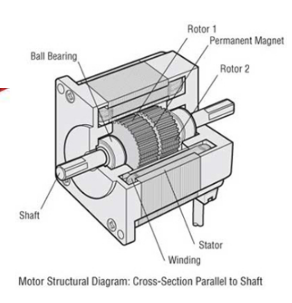
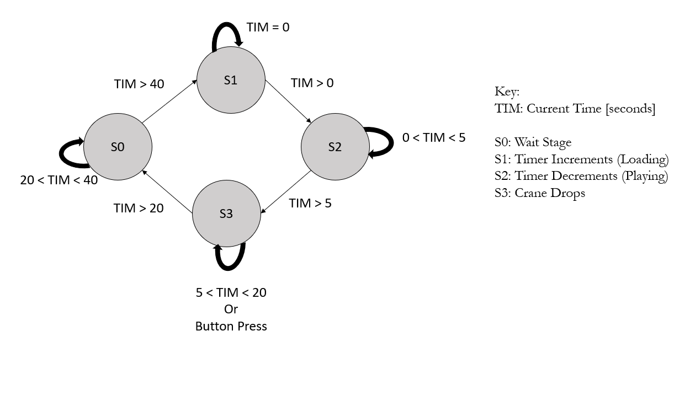
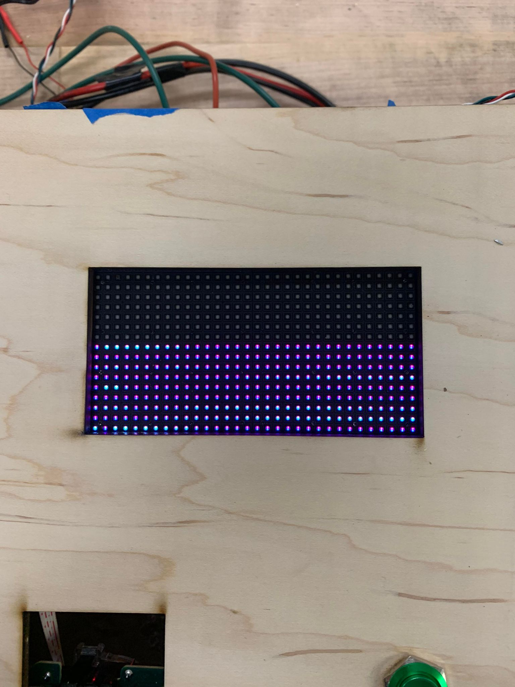
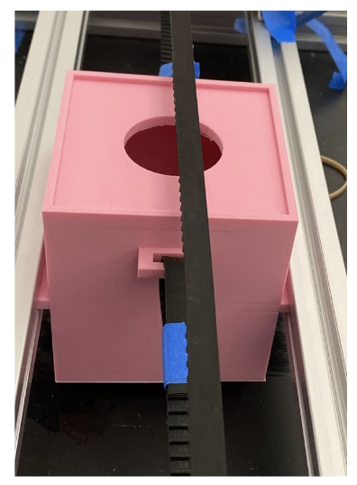
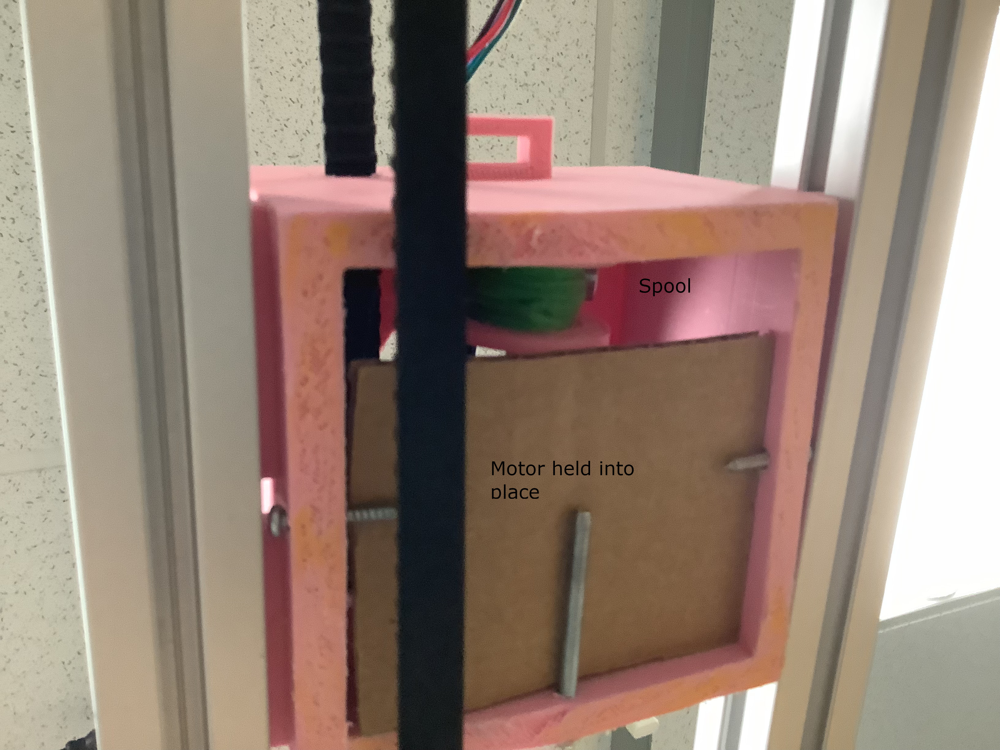
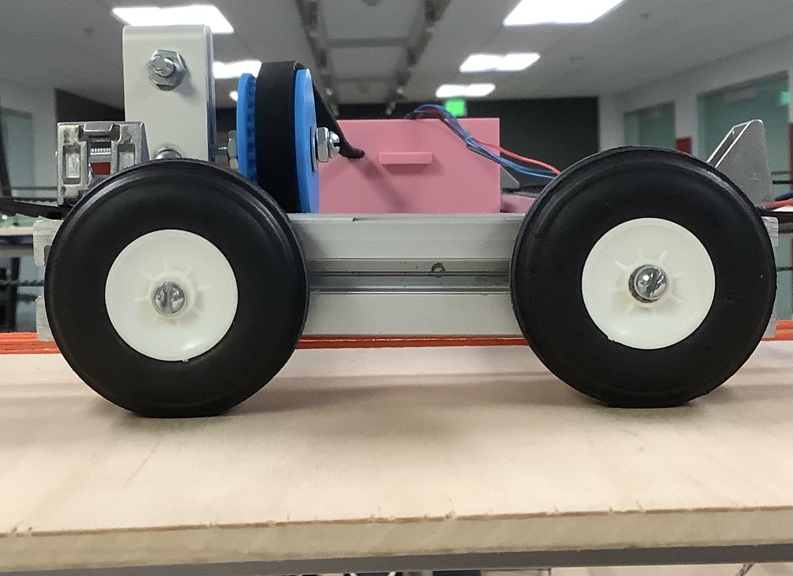
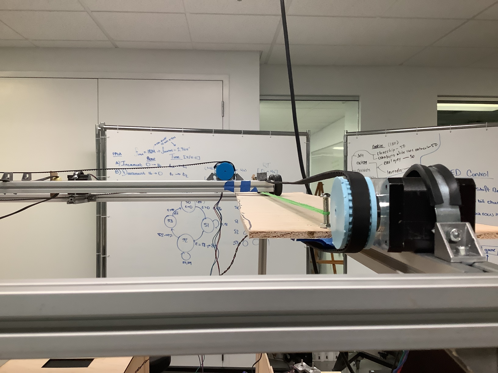

# MCU Design
The microcontroller inputs are the start button, end button, and Joystick pins and it outputs signals to control the gantry motors and the magnet motor. The motors being used are stepper motors for their accuracy and torque and they require 4 pins each because they have two coils inside[2] that need to each receive a signal in a pulse train that allows the motor to spin in succession. The L293D Quadruple Half-H Drivers were used to drive the motors from the MCU. The motor drivers serve to eliminate drawing too much current from the MCU and connecting enough voltage. The motors require 5V to drive them so the motor drivers had a Vcc line and 4 enable pins from the MCU and the 4 pins from the motor were attached to their corresponding MCU pin. There were also enable pins that were set to 3.3V power. The middle motor is a 12V motor for extra power needed to move the center of the x-axis frame. The 5V and 12 V were provided by an external power supply. [1]

  

The MCU code dictates the direction the motors spin based on the intended direction switched on from moving the joy stick up, down, left, and right. The order in which the four pins are turned on and off decides the movement. Since we want the three motors in the center to move at the same time they all share the same 4 MCU pins to turn them on. The two side motors are mirrored so the wiring of one is opposite to the other so that they move the same direction. 

  

# FPGA Design
#### Display Stages
The FPGA's main funtionality revolves around displaying the timer and other states of the system throughout the user's interaction.  During the user's interact, the display will increment when starting, decrement during the movement stage, and flash at the end.  This is accomplished through state logic demonstrated in the figure below.

  

As shown in the figure, we can see that we have a variable, TIM, that increments after the user begins.  TIM increments based on a slow clock generated by dividing down the onboard 48 MHz HOSC to around 2.8 Hz.  This provides the user with sufficient time to perform each of the duties and allocates a reasonable starting time.

Initially, the team planned on displaying numbers as a countdown, but after signfiicant testing, the team decided the given LED matrix did not have full functionality. However despite issues with the display, the team was able to set the timer to be a decrementing "tank" as time passed by turning off rows of the display. Inversely, the team could increment the "tank" as an initializing sequence and also flash it upon completion.  This functionality will be discussed further in the next section. 

  

#### Display Hardware Design
The display itself is not straightforward to interface with, but a previous Microps final project revolved around creating custom pictures on it.  In 2019, Reem Alkhamis and Sabrine Griffith's project "LED Visual Art" displayed images on the display that would alter depending on input from a IMU.  Since our project was not primarily focused on the display, we were able to leverage their setup to begin our work.  A big thanks to them both for providing us with a great starting point.  A big hint to the LED display lacking full functionality was their project not functioning properly.

The 32x32 LED display works by setting the RGB value of each LED in each 32 LED row through multiplexing and a 192 bit shift register.  The 192 bit shift register contains the RGB values of 2 whole rows.  Then, through a row control input, you select the two rows that display the values.  With a fast enough clock, this is seemless and there is not bleeding.  There are additional signals that accompany the control signals such as a output enable and latch.  These signals control the transition from one row to the next as time passes.

The issue we encountered with the display was the inconsistent display of RGB values.  The previous project utilizted RAM to store and access the necessary RGB data, and when we tried to incorporate their design, it did not consistently function.  However, we were able to get the LED matrix to fully turn on.  From there, we could control which rows were getting outputted so we would have an incrementing, decrementing, or flashing display.  

As noted above, these stages were each controlled by both the TIM variable as well as the button press.  The TIM variable would increment with the slow clock and with the use of assign statements in the top level module along with some booleans, we can manipulate the signal even further to being slow. The decrementing is much slower than the incrementing because the columns only decrement every fourth clock signal when the timer is in the select range. Additionally, the flashing is achieved by inverting the maximum row value at each clock cycle from 0 to 16.  

Lastly, as noted above, the FPGA is only controlled via a single bit enable line from the MCU.  The enable line is asserted upon the first button push and deasserted on the second.  If never deasserted, the FPGA timer will reach a maximum value, and perform the final flash automatically. This does not need to be sent over to the MCU because the clocks are synchronized to a significant resolution.

# Mechanical Design
The main frame is square at 4ft by 4ft and is about 2ft high. The frame supports a two axis gantry to move the box with the magnet that drops down to pick up prizes. The frame is completely made out of 80/20 aluminum extrusion and the magnet housing and the pulley wheels on the motors are made out of PLA. 
The design utilizes 1 stepper motor to move the magnet housing side to side in the x direction, which slides on two 80/20 bars.

  

A rubber belt is secured on either side of the box to allow it to be pulled back and forth by the motor. Plastic pulleys were 3D printed to get the size of the belt teeth and width of the belt correct to allow the belt to grab enough on the pulley to initiate rotation
Inside the box is another stepper motor that has a spool attached to it that drops and lifts up the magnet at the end of the game. 

  

The ends of the two rails are secured with smaller pieces of 80/20 and wheels are attached to allow for the whole x-axis to move along the y-axis, creating a 2D plane for game play. 

  

3 stepper motors move the y-axis because two are needed on either side and one is needed in the center to account for uneven drift side to side. 

  

A wide board of wood is placed on the track the wheels move down in order to allow for any drift that may occur. The wood holds in place taut strings that two screws on the undercarriage of the x-axis bars slide between to keep the wheels on track. 

