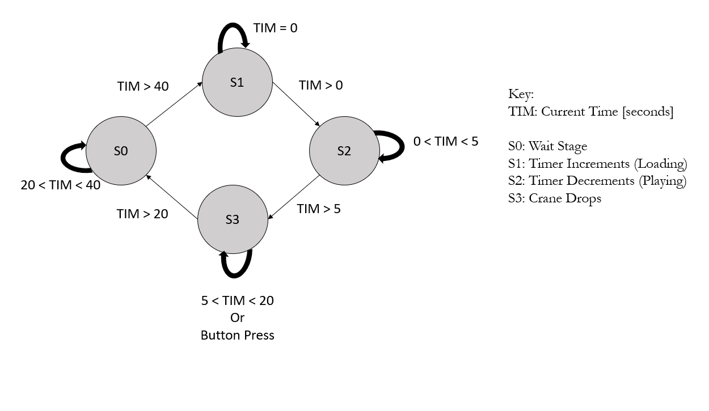

# Schematics
### Overall System Level Diagram

  

### Game Timing Diagram

  

### System Schematic

  

# Source Code Overview
<!-- This section should include information to describe the organization of the code base and highlight how the code connects. -->

The source code for the project is located in the Github repository [here](https://github.com/mcook26/Crane-Game/tree/main/src).

The MCU code is organized by having multiple sequential while loops.  Because gameplay is rather streamlined with few places of variability, it is easier to design using this structure. The first step is to press the button which exits the first loop. Then once the timer is up or the button is pressed again, you exit the second loop.  Finally, once the system attempts to return home, the final two loops are exited. 

As noted in the design section, the MCU interfaces with the FGPA via a 1 bit enable line that is asserted upon the first button push and deasserted after the second button push or time runs out. This line directly controls each stage of the FGPA's display sequence by either starting or ending it.

The FGPA code is organized into a top level module that controls all of the functionality as well as performs boolean operations to set the display output.  These are determined based on the timer submodule which increments after each slow clock cycle.  More details are provided in the FGPA section.

# Bill of Materials
<!-- The bill of materials should include all the parts used in your project along with the prices and links.  -->

| Item | Part Number | Quantity | Unit Price | Link |
| ---- | ----------- | ----- | ---- | ---- |
| Adafruit VL53L0X Time of Flight Distance Sensor |  3317 | 1 | $14.95 |  [link](https://www.adafruit.com/product/3317) |

**Total cost: $14.95**
